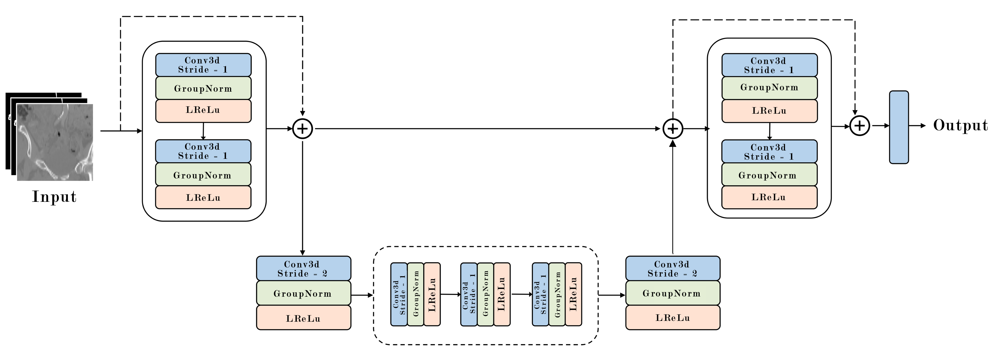

# Automated Segmentation of Peripheral Arteries in 3D CT Data Based on a Single-Depth Vascular Network

## WORK IN PROGRESS
## Introduction
This repository contains source code for the automated segmentation of peripheral arteries from 3D CT scans using a Single-Depth Vascular Network (SDVN). The pipeline allows preprocessing, training, and evaluation of segmentation models for medical imaging research.

## SDVN

## Pipeline
The pipeline performs:
- Preprocessing of CT scans (normalization, resampling, ROI extraction)
- Training of the SDVN model
- Model evaluation and inference on test CT scans

## Requirements
- PyTorch
- SimpleITK
- NumPy, SciPy

## Citation
If you use this work in your research, please cite:

Manahil Zulfiqar, Maciej Stanuch, Sylvia Vagena, Fragiska Sigala, Andrzej Skalski,
Automated segmentation of peripheral arteries in 3D CT data based on a Single-Depth vascular network,
Biomedical Signal Processing and Control,
Volume 112, Part A,
2026,
108410,
ISSN 1746-8094,
https://doi.org/10.1016/j.bspc.2025.108410.
(https://www.sciencedirect.com/science/article/pii/S1746809425009218)

## Acknowledgements
This study is funded with European Union's Horizon 2020 research and innovation programme under the Marie Skłodowska-Curie grant agreement No 956470.
